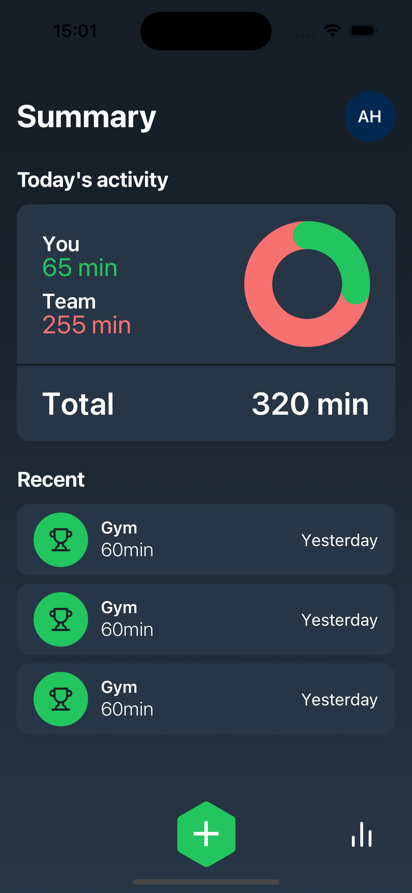
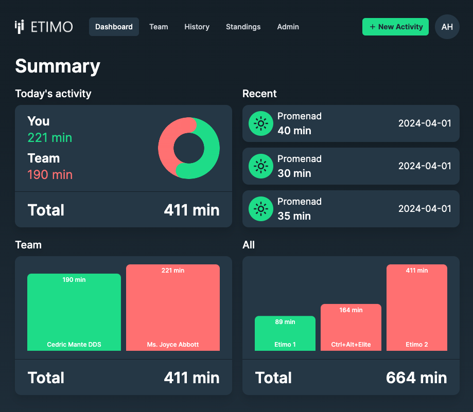

# EAT (Etimo Activity Tracker)

Aktivitetstävlingsapp skriven i **React Native** och **Next.js**. Front-end delas mellan native och web.

<div style="display: flex; flex-direction: column; align-items: start; gap:16px;">
<div>
<div style="font-weight: 800">Native</div>

</div>
<div>
<div style="font-weight: 800">Web</div>

</div>
</div>

### Setup

```bash
yarn
cd apps/eat-native && yarn
```

### Utveckling

[Expo Dev Client](https://docs.expo.dev/develop/development-builds/introduction/) används vid utveckling av native. För att kunna köra denna på en telefon behöver denna registeras via [eas](https://docs.expo.dev/develop/development-builds/create-a-build/#create-a-build-for-the-device).

```bash
# Native
yarn native

 # Web
yarn web
```

### Dependencies

Native

```bash
cd apps/eat-native && expo install <dependency>
cd apps/eat-native && yarn add <dependency>
```

Web / Shared

```bash
cd packages/shared && yarn add <dependency>
cd ../.. && yarn
```

### Övrig dokumentation

- [Expo](https://docs.expo.dev/)
- [EAS](https://docs.expo.dev/build/introduction/)
- [React Native](https://reactnative.dev/)
- [Next.Js](https://nextjs.org/docs)
- [Gluestack-ui](https://gluestack.io/ui/docs/overview/introduction) (Komponenter)
- [Zustand](https://github.com/pmndrs/zustand) (Global state)
- [Solito](https://solito.dev/) (Navigering)
